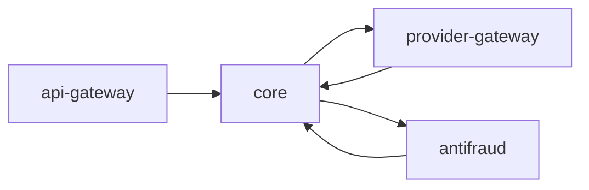
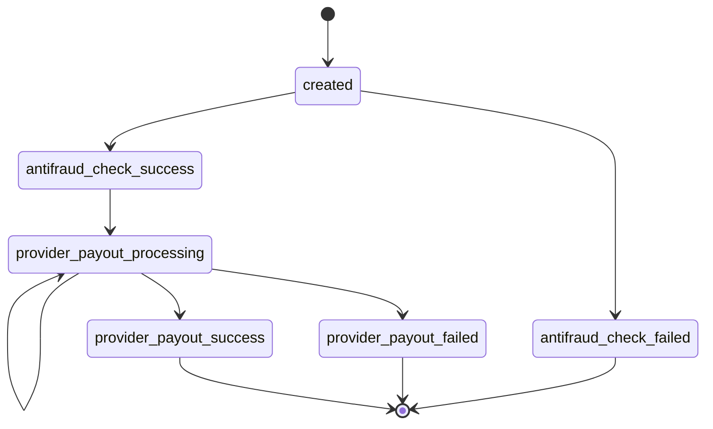

# Mercuryo Ruby Challenge

## Описание задания

Необходимо реализовать сервис аккаунтинга, который ведет учет балансов и транзакций.

К каждому магазину будет привязан счет.
Он будет пополняться виртуальной суммой менеджером.
При прохождении успешного платежа, его сумма должна списываться со счета.
Если денег на счету недостаточно - платеж должен отклоняться.

### Требования к производительности

Сервис должен быть рассчитан на высокую нагрузку:
- Количество аккаунтов: тысячи
- Объем транзакций: десятки миллионов записей

## Текущая архитектура сервисов



## Текущая схема статусов



## Миграции (Sequel)

Запуск миграций:

```bash
cd app
bundle exec ruby db/migrate.rb
```
